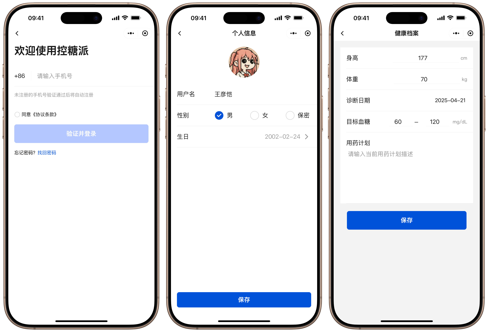
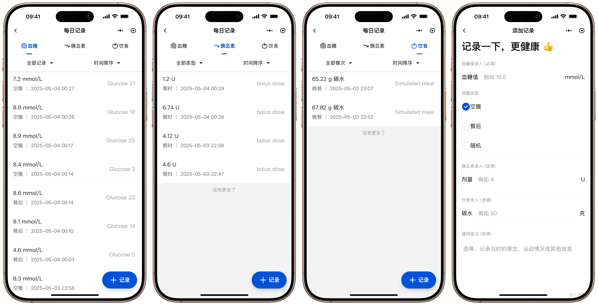
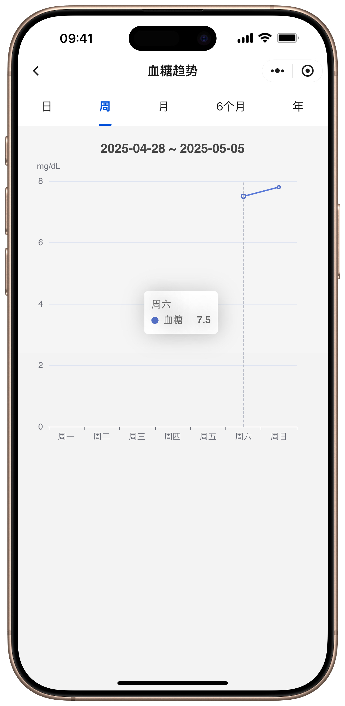
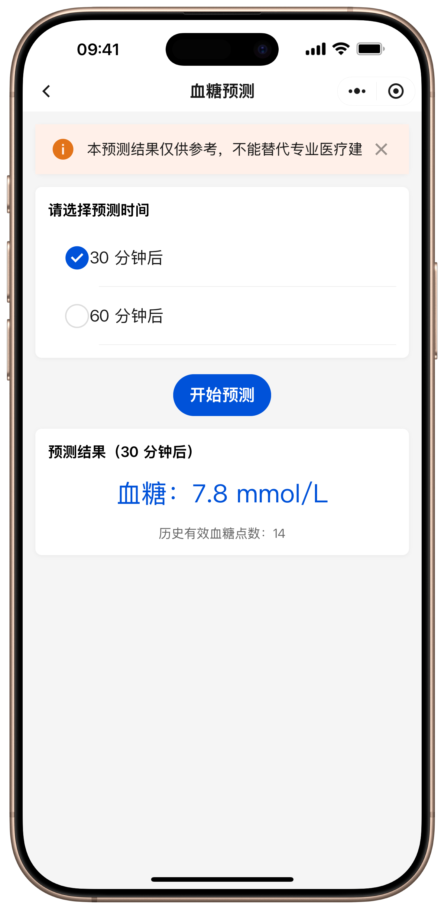
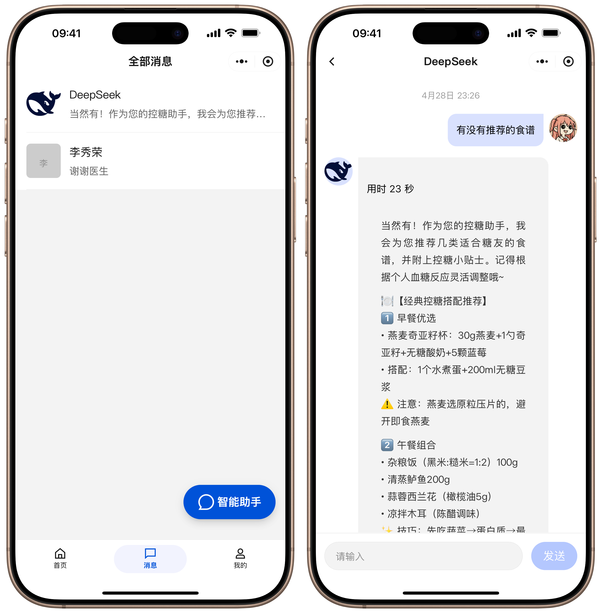
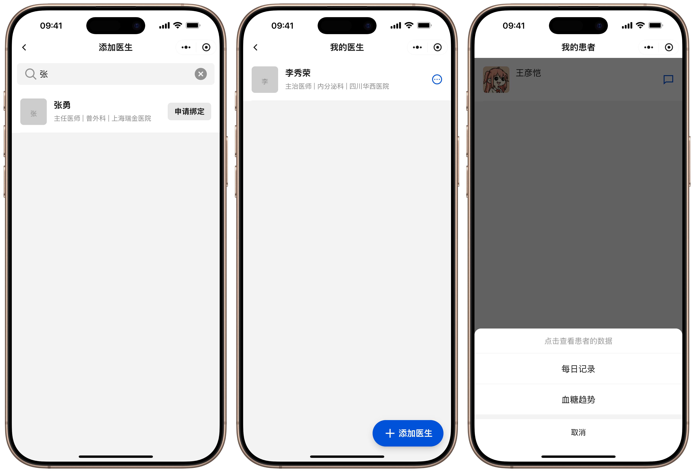

# GlucoPI

[简体中文](./README.zh-CN.md)

<p align="center">
  
</p>

<p align="center">
  A WeChat Mini Program for diabetes self-management, doctor follow-up, and short-horizon glucose prediction.
</p>

## Overview

GlucoPI is an undergraduate graduation project that combines a WeChat Mini Program frontend with a FastAPI backend for diabetes-oriented daily health management.

The system focuses on three practical goals:

- making glucose records easier to collect and review
- improving communication between patients and doctors
- providing short-term glucose prediction and health assistance

## Highlights

- WeChat Mini Program experience tailored for mobile-first daily use
- FastAPI backend with MySQL and MongoDB integration
- patient and doctor roles with profile and follow-up workflows
- blood glucose recording, trend visualization, and prediction
- real-time chat support between users and doctors
- LLM-assisted health conversation support

## Screenshots

<p align="center">
  
</p>

<p align="center">
  
</p>

<p align="center">
  
  
</p>

<p align="center">
  
</p>

<p align="center">
  
</p>

## Repository Structure

```text
glucopi/
├─ backend/                # FastAPI backend service
├─ frontend/miniprogram/   # WeChat Mini Program frontend
└─ docs/                   # screenshots and documentation assets
```

## Tech Stack

- Frontend: WeChat Mini Program, JavaScript, LESS, TDesign Mini Program
- Backend: FastAPI, SQLAlchemy, Motor, MySQL, MongoDB
- AI / Prediction: OpenAI-compatible LLM API, PyTorch, NumPy, Pandas

## Quick Start

### Backend

```bash
cd backend
pip install -r requirements.txt
cp .env.example .env
uvicorn app.main:app --reload
```

### Frontend

```bash
cd frontend/miniprogram
npm install
```

Then update `frontend/miniprogram/utils/api-config.js` with your deployed HTTP and WebSocket endpoints, and import the project into WeChat DevTools.

## Notes

- The repository is intentionally cleaned for GitHub upload.
- Local-only files such as `.env`, `node_modules`, `miniprogram_npm`, and private WeChat project settings are excluded.
- Some backend services depend on external credentials, databases, and model checkpoints.

## Acknowledgement

The glucose prediction part of this project was developed with reference to [r-cui/GluPred](https://github.com/r-cui/GluPred), the official repository for the paper "Personalised Short-Term Glucose Prediction via Recurrent Self-Attention Network".

The dataset used for the prediction workflow is the OhioT1DM dataset.

## License

This project is released under the MIT License. See [LICENSE](./LICENSE).
